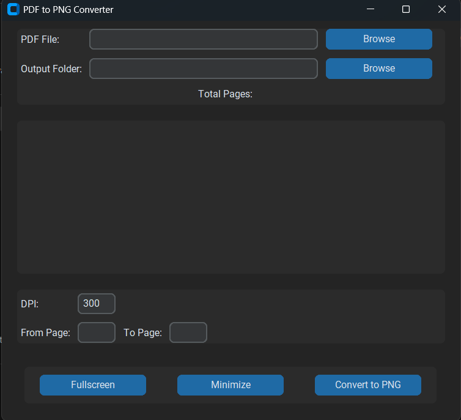

# PDF to PNG Converter

**A simple and user-friendly desktop application built with Python and CustomTkinter to convert PDF files into PNG images.**

<p align="center">
    
</p>

## Features

- **Convert PDFs to PNGs:** Efficiently convert your PDF documents into high-quality PNG images.
- **DPI Selection:** Control the resolution (DPI) of the output PNG images.
- **Page Range Selection:** Convert specific pages or a range of pages from your PDF.
- **Fullscreen Mode:** Maximize the application window for a larger view.
- **Minimize:** Minimize the application to the taskbar.
- **User-Friendly Interface:** Intuitive and easy-to-use design powered by CustomTkinter.
- **No External Dependencies (except Python):** The application uses the PyMuPDF library, a pure Python library for handling PDFs, eliminating the need for external software like Poppler.

## Why PyMuPDF?

This application uses PyMuPDF (fitz) instead of other PDF libraries (like `pdf2image`) for these key reasons:

- **No External Dependencies:** PyMuPDF simplifies installation and distribution, as users don't need to install separate software.
- **Lightweight and Fast:** PyMuPDF is generally more efficient, resulting in faster conversions and a smaller application footprint.
- **Cross-Platform Compatibility:** PyMuPDF ensures smooth operation across Windows, macOS, and Linux without platform-specific configurations.

## Installation

**Requirements:**

- **Python 3.x:** Check your Python version using `python --version` or `python3 --version`.

**Steps:**

1. **Install Libraries:**

   ```bash
   pip install customtkinter pymupdf
   ```

2. **Run:**
   ```bash
   python app.py
   ```

## Usage

1. **Select PDF:** Click "Browse" for "PDF File" and choose your PDF.
2. **Choose Output Folder:** Click "Browse" for "Output Folder" to select the save location.
3. **Set DPI (Optional):** Enter desired DPI (default: 300).
4. **Select Page Range (Optional):** Enter start and end pages (e.g., "1-3"). Leave blank for all pages.
5. **Convert:** Click "Convert to PNG". Images will be saved in the output folder.
6. **Fullscreen/Minimize:** Use respective buttons to control the window.

## Packaging (Optional)

Create a standalone executable using PyInstaller:

1. **Install PyInstaller:**

   ```bash
   pip install pyinstaller
   ```

2. **Package:**
   ```bash
   pyinstaller --onefile --noconsole --icon=assets/app_icon.ico --add-data="assets/*;assets/" app.py
   ```

## Contributing

Pull requests are welcome. Open an issue first for major changes.

## License

MIT License

Copyright (c) 2023 Manjil Budhathoki

Permission is hereby granted, free of charge, to any person obtaining a copy of this software and associated documentation files (the "Software"), to deal in the Software without restriction, including without limitation the rights to use, copy, modify, merge, publish, distribute, sublicense, and/or sell copies of the Software, and to permit persons to whom the Software is furnished to do so, subject to the following conditions:

The above copyright notice and this permission notice shall be included in all copies or substantial portions of the Software.

THE SOFTWARE IS PROVIDED "AS IS", WITHOUT WARRANTY OF ANY KIND, EXPRESS OR IMPLIED, INCLUDING BUT NOT LIMITED TO THE WARRANTIES OF MERCHANTABILITY, FITNESS FOR A PARTICULAR PURPOSE AND NONINFRINGEMENT. IN NO EVENT SHALL THE AUTHORS OR COPYRIGHT HOLDERS BE LIABLE FOR ANY CLAIM, DAMAGES OR OTHER LIABILITY, WHETHER IN AN ACTION OF CONTRACT, TORT OR OTHERWISE, ARISING FROM, OUT OF OR IN CONNECTION WITH THE SOFTWARE OR THE USE OR OTHER DEALINGS IN THE SOFTWARE.

## Created By

# [Manjil Budhathoki] - [https://github.com/manjil-budhathoki]
